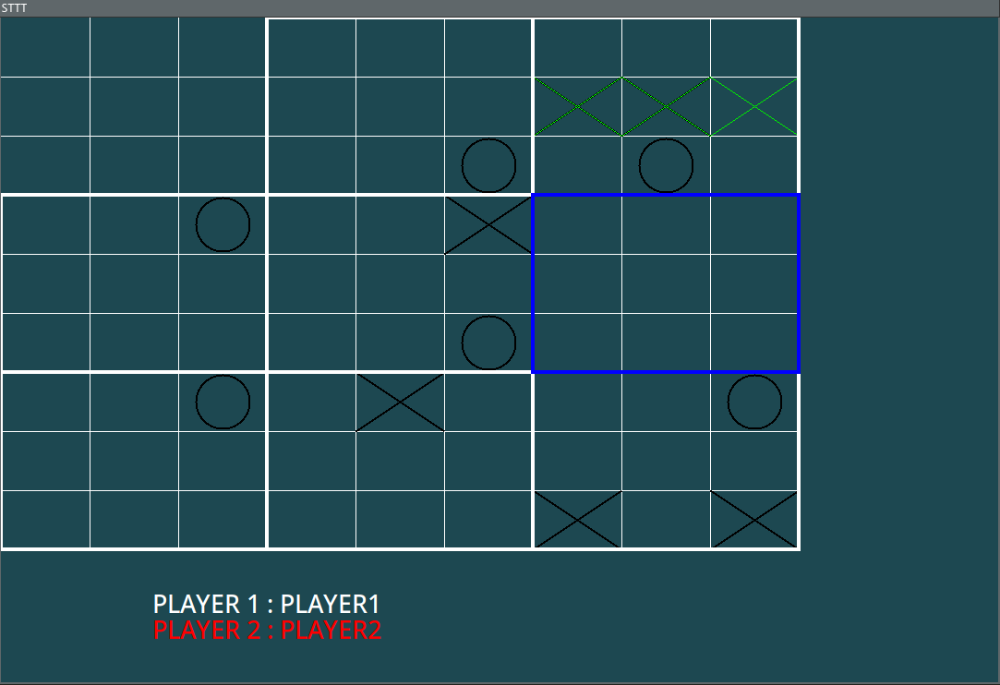

# SUPERTTT

### Prerequisites
* python3
* tkinter

### Installation
* `git clone https://www.github.com/theduv/superttt`

### Usage
* `python3 ./main.py`

### Gameplay
This game consists on 9 grids of tic tac toe games next to each other.
To win the game, you have to complete the "largest grid", by winning 3 small grids following the same rules as a classic tic tac toe game.
The thing is, when you hit for example the top right corner of the current grid, the next player will have to play in the top right small grid, and so on.
